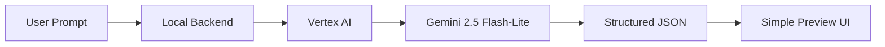
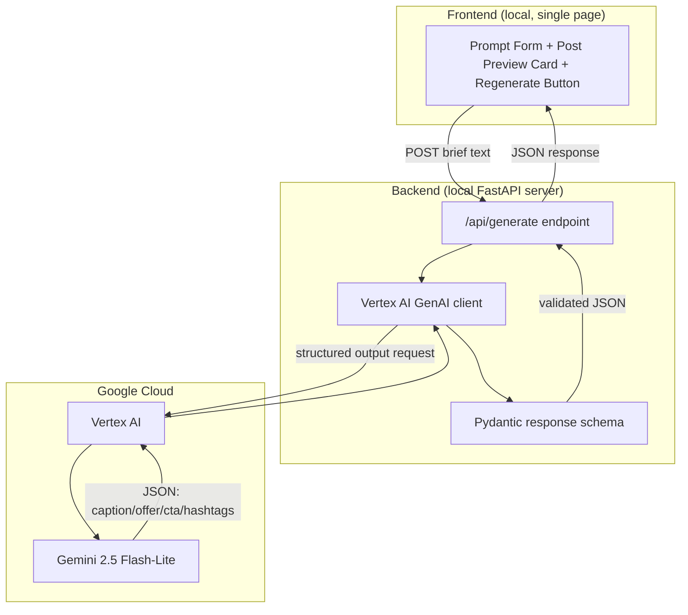

# Social Post Generation — Implementation Plan
### R&D Workflow: Client Showcase Prototype

> Source: `social-post-generation-workflow-plan.pdf`

---

## 1. Plan Analysis (Summary)

**Objective:** Validate an AI-assisted workflow that turns a short advertisement brief into a clear, ready-to-review social post. Focus is on reliable structured content + a polished *local* visual preview for a client demo — **not** a production system.

**End-to-end workflow (from the PDF):**



The backend sends the brief through Vertex AI to Gemini, receives a predictable JSON response, and passes it to the local preview UI for presentation.

**Structured Output contract:**

| Field | Purpose |
|---|---|
| `caption` | Main social-media copy written from the user brief |
| `offer` / `key_message` | Core promotion, announcement, or value proposition |
| `cta` | Clear next action (visit, order, enquire, learn more) |
| `hashtags` | Relevant discoverability tags, formatted for social platforms |

**Showcase UI purpose:** presentation layer only — renders the JSON as a believable social post (not raw JSON) so a client can judge quality at a glance.

**In scope:**
- Prompt input + generation trigger
- Local backend integration
- Vertex AI + Gemini 2.5 Flash-Lite
- Structured JSON response
- Local preview UI with a **Regenerate** option

**Explicitly out of scope:**
- Platform APIs, publishing, scheduling
- User auth / accounts
- Production app or full frontend
- Video or audio generation

**Recommended deliverable:** Gemini API integration + local backend + simple showcase UI, designed so future "platform adapters" can consume the same structured JSON later (not built now).

---

## 2. Proposed Architecture

Keep this intentionally small — it's a throwaway-quality prototype in service of a demo, not a platform.



**Stack recommendation:**

| Layer | Choice | Why |
|---|---|---|
| Backend | Python + FastAPI | Official Google GenAI SDK is Python-first; FastAPI is minimal and fast to stand up locally |
| AI SDK | `google-genai` (unified Google GenAI SDK) | Single SDK that talks to Vertex AI *or* the Gemini Developer API by flipping one flag — supports typed structured output natively |
| Structured output | Pydantic model + `response_schema` | Gemini enforces the schema server-side → reliably parseable JSON every time |
| Frontend | React + Vite (or plain HTML/JS if you want zero build step) | Enough polish for a client demo without framework overhead |
| Auth to GCP | Application Default Credentials (ADC) via `gcloud auth application-default login` | No secrets to manage locally; uses your own GCP user identity + billing/credits |

If you want something even faster than React for the demo, a single-file **Streamlit** app is a legitimate alternative to the FastAPI+React split — call it out as Option B below.

---

## 3. Vertex AI Setup — Using Your Existing GCP Credits

This is the part that lets the backend actually call Gemini 2.5 Flash-Lite and bill against your existing GCP credit balance.

### Step 1 — Pick/confirm the GCP project with credits
1. Go to the [GCP Console](https://console.cloud.google.com/).
2. Top bar → project selector → confirm you're on the project where your credits are applied (or create a new project under that billing account: **IAM & Admin → Create a Project**).
3. Go to **Billing** → confirm this project is **linked to the billing account** that holds your credits (Billing → *Account Management* → *Link a billing account* if it isn't linked yet).

### Step 2 — Enable the Vertex AI API
1. In the console, go to **APIs & Services → Library**.
2. Search for **"Vertex AI API"** → click **Enable** (this covers Gemini model access via Vertex AI, no separate toggle needed).

Or via CLI:
```bash
gcloud services enable aiplatform.googleapis.com --project=YOUR_PROJECT_ID
```

### Step 3 — Confirm Gemini 2.5 Flash-Lite availability
1. Console → **Vertex AI → Model Garden** → search "Gemini 2.5 Flash-Lite".
2. Note a supported region (e.g. `us-central1` is the safest default; confirm the model is listed as available there before building region-specific logic).

### Step 4 — Install the Google Cloud CLI (if not already installed)
- Windows: install via the [official installer](https://cloud.google.com/sdk/docs/install).
- Verify: `gcloud --version`

### Step 5 — Authenticate locally (Application Default Credentials)
This lets your local backend call Vertex AI *as you*, billed to your project/credits — no service-account JSON key to manage for a local prototype.

```bash
gcloud auth login
gcloud config set project YOUR_PROJECT_ID
gcloud auth application-default login
```

This stores credentials at `~/.config/gcloud/application_default_credentials.json` (Linux/macOS) or `%APPDATA%\gcloud\application_default_credentials.json` (Windows), and the `google-genai` SDK will pick these up automatically.

> Alternative (service account): only needed if you want to run this outside your own user context (e.g. CI). For a local demo, ADC above is simpler and sufficient.
> ```bash
> gcloud iam service-accounts create social-post-genr-sa
> gcloud projects add-iam-policy-binding YOUR_PROJECT_ID \
>   --member="serviceAccount:social-post-genr-sa@YOUR_PROJECT_ID.iam.gserviceaccount.com" \
>   --role="roles/aiplatform.user"
> gcloud iam service-accounts keys create key.json \
>   --iam-account=social-post-genr-sa@YOUR_PROJECT_ID.iam.gserviceaccount.com
> ```
> Then set `GOOGLE_APPLICATION_CREDENTIALS=path/to/key.json` and **never commit `key.json`** — add it to `.gitignore`.

### Step 6 — Set environment variables for the project
Create a local `.env` (git-ignored):
```env
GOOGLE_CLOUD_PROJECT=YOUR_PROJECT_ID
GOOGLE_CLOUD_LOCATION=us-central1
GOOGLE_GENAI_USE_VERTEXAI=True
GEMINI_MODEL=gemini-2.5-flash-lite
```

### Step 7 — Install the SDK
```bash
pip install google-genai fastapi uvicorn python-dotenv pydantic
```

### Step 8 — Sanity-check call (structured output)
Quick script to confirm billing/credits + model access work end-to-end before wiring up the backend:

```python
import os
from google import genai
from google.genai.types import GenerateContentConfig
from pydantic import BaseModel
from dotenv import load_dotenv

load_dotenv()

class SocialPost(BaseModel):
    caption: str
    offer: str
    cta: str
    hashtags: list[str]

client = genai.Client(
    vertexai=True,
    project=os.environ["GOOGLE_CLOUD_PROJECT"],
    location=os.environ["GOOGLE_CLOUD_LOCATION"],
)

response = client.models.generate_content(
    model=os.environ["GEMINI_MODEL"],
    contents="Brief: 20% off all yoga mats this weekend at ZenFit Studio.",
    config=GenerateContentConfig(
        response_mime_type="application/json",
        response_schema=SocialPost,
    ),
)

print(response.parsed)  # -> validated SocialPost instance
```

Run it:
```bash
python test_vertex_call.py
```

If this prints a populated `SocialPost` object, Vertex AI is wired up correctly and usage will bill against your project's credits.

### Step 9 — Guard your credits
1. **Billing → Budgets & alerts** → create a budget alert (e.g. $5 / $20 thresholds) on the project so you get emailed if usage climbs — cheap insurance since Flash-Lite is inexpensive but you're demoing repeatedly.
2. Keep `gemini-2.5-flash-lite` (not a Pro/heavier model) since the plan explicitly calls it out — it's the cheapest, fastest Gemini tier, well suited to short structured JSON generations.

---

## 4. Backend Implementation Plan

**Suggested structure:**
```
backend/
  app/
    main.py            # FastAPI app + CORS + /api/generate route
    schema.py          # Pydantic SocialPost model (caption, offer, cta, hashtags)
    gemini_client.py   # google-genai client wrapper + prompt template
    config.py          # env var loading
  requirements.txt
  .env                 # git-ignored
```

**Tasks:**
1. `config.py` — load `GOOGLE_CLOUD_PROJECT`, `GOOGLE_CLOUD_LOCATION`, `GEMINI_MODEL` from env.
2. `schema.py` — define the `SocialPost` Pydantic model matching the PDF's contract exactly:
   ```python
   class SocialPost(BaseModel):
       caption: str
       offer: str        # "offer / key message"
       cta: str
       hashtags: list[str]
   ```
3. `gemini_client.py`:
   - Build a system/instruction prompt that tells Gemini: *"You are a social media copywriter. Given an ad brief, produce a caption, the core offer/key message, a clear CTA, and 3–6 relevant hashtags."*
   - Call `generate_content` with `response_schema=SocialPost` for guaranteed structured output.
   - Wrap in a small retry (1 retry) for transient API errors.
4. `main.py`:
   - `POST /api/generate` — body: `{ "brief": "<user prompt text>" }` → returns the `SocialPost` JSON.
   - Reuse the same endpoint for **regenerate** (frontend just calls it again, optionally with a `variation` flag that nudges `temperature` slightly for a different result).
   - Enable CORS for local frontend origin (e.g. `http://localhost:5173`).
5. Basic error handling: empty brief → 400; Vertex AI failure → 502 with a friendly message (important for a live client demo — don't crash on a hiccup).

---

## 5. Frontend Implementation Plan

**Suggested structure:**
```
frontend/
  src/
    App.tsx
    components/
      BriefForm.tsx        # textarea + "Generate" button
      PostPreviewCard.tsx  # renders caption/offer/cta/hashtags as a social post
      RegenerateButton.tsx
    api.ts                 # fetch wrapper for /api/generate
  index.html
```

**Tasks:**
1. **Brief form** — textarea for the ad brief + "Generate" button, disabled/loading state while awaiting the backend.
2. **Post preview card** — styled to *look like* a real social post (avatar placeholder, "post" bubble with caption, offer highlighted, CTA as a button-like element, hashtags styled as tags/pills). This is the whole point of the UI per the PDF — presentation, not raw JSON.
3. **Regenerate button** — re-triggers the same brief through `/api/generate`; show a subtle loading transition on the card so it feels responsive in a live demo.
4. **Empty/error states** — friendly message if the backend call fails (again, this will likely be demoed live to a client).
5. Optional nice-to-have: keep the last 2–3 generations so you can flip back during the demo if the client wants to compare ("regenerate history").

**Option B (faster to build):** Replace the whole frontend with a single Streamlit app (`streamlit run app.py`) that has a text input, a "Generate" button, and `st.markdown`-rendered post card + a "Regenerate" button. Trade-off: less visual polish, but you could have this working in under an hour, calling `gemini_client.py` directly with no separate backend process.

---

## 6. Milestones / Sequencing

| # | Milestone | Outcome |
|---|---|---|
| 1 | GCP + Vertex AI setup (Section 3) | Confirmed API call works, billed to your credits |
| 2 | Backend `/api/generate` with schema-enforced JSON | `curl` returns valid `caption/offer/cta/hashtags` for a sample brief |
| 3 | Minimal frontend wired to backend | Can submit a brief and see raw-but-correct data render |
| 4 | Preview card styling pass | Output looks like a believable social post, not a form |
| 5 | Regenerate flow | Re-running produces a materially different, still-valid post |
| 6 | Demo hardening | Handles empty input, slow responses, and API errors gracefully; 2–3 rehearsed sample briefs ready |

---

## 7. Explicitly Not Building (per PDF scope boundaries)

Do **not** spend time on any of the following for this R&D pass — call these out to the client as *future* work if asked:
- Publishing/scheduling to real platform APIs (Instagram/Facebook/LinkedIn/etc.)
- User authentication or multi-user accounts
- A production-grade frontend or design system
- Image, video, or audio generation
- Persistence/database layer (in-memory / session-only state is fine)

The one deliberate hook for the future, per the plan: keep the structured JSON contract (`caption`, `offer`, `cta`, `hashtags`) stable, since it's what a later "platform adapter" layer would consume.

---

## 8. Open Questions to Confirm Before Building

1. Should `offer` and `key_message` be one field or two separate fields in the JSON schema? (PDF lists them as "offer / key message" — I've modeled it as a single `offer` field above; easy to split if you want both.)
2. Any target hashtag count range (e.g. exactly 5) or platform-specific formatting (Instagram vs. LinkedIn tone)?
3. Do you want the "regenerate" to reuse the exact same brief only, or also allow light on-the-fly edits to the brief before regenerating?
